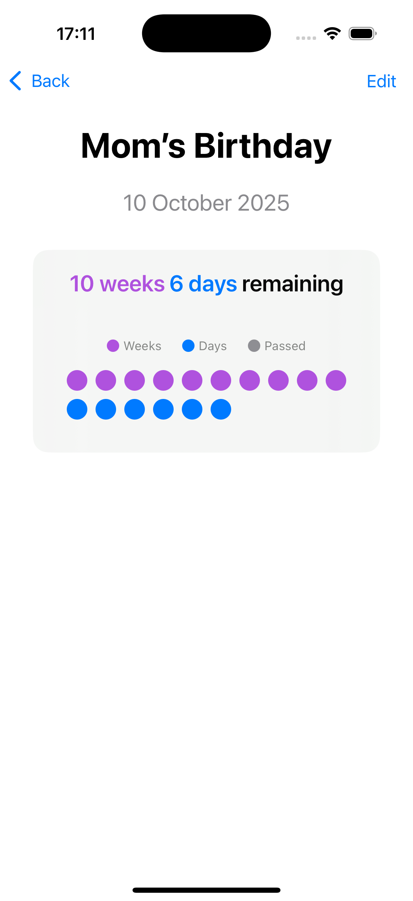

# timeleft - iOS Time Tracking App

A clean, intuitive iOS SwiftUI application that helps you visualize time remaining until important events with a beautiful dot-based progress visualization.

## Features

- **Event Management**: Add, edit, and delete events with custom names and target dates
- **Smart Time Display**: 
  - Days only for events ≤30 days away
  - Weeks and days for events 30-90 days away  
  - Months, weeks, and days for events >90 days away
- **Visual Progress**: Dot-based visualization where each dot represents a time unit
- **Color-Coded Display**: Different colors for months (orange), weeks (purple), and days (blue)
- **Event List**: Clean interface showing all your events sorted by date
- **Home Screen Widgets**: Display event countdowns directly on your home screen
  - Small, Medium, and Large widget sizes
  - Configurable event selection per widget
  - Floral theme matching the main app
  - Automatic updates with app data synchronization
- **Persistent Storage**: Events are saved locally using UserDefaults

## Screenshots



## Technical Details

- **Platform**: iOS 18.5+, macOS 15.5+, visionOS 2.5+
- **Framework**: SwiftUI
- **Architecture**: Single-view app with NavigationView
- **Storage**: UserDefaults with JSON encoding
- **Testing**: Swift Testing framework

## Getting Started

1. Open `timeleft.xcodeproj` in Xcode 16.4+
2. Select your target device or simulator
3. Build and run (Cmd+R)

## Usage

1. **Add Event**: Tap the "+" button to create a new event
2. **View Details**: Tap any event to see detailed time breakdown and dot visualization
3. **Edit Event**: Use the "Edit" button in event details to modify events
4. **Delete Event**: Swipe left on any event in the list
5. **Add Widget**: Long press home screen → tap "+" → search "Timeleft" → select widget size → configure event selection

## Time Format Logic

- **≤30 days**: Shows days only (e.g., "10 days")
- **31-90 days**: Shows weeks + days (e.g., "10w 6d") 
- **>90 days**: Shows months + weeks + days (e.g., "10m 1w 3d")

## Dot Visualization

Each dot represents one time unit:
- 🟠 Orange dots = 1 month each
- 🟣 Purple dots = 1 week each  
- 🔵 Blue dots = 1 day each
- ⚪ Gray dots = Passed time units

## Build Commands

```bash
# Build for Debug
xcodebuild -project timeleft.xcodeproj -scheme timeleft -configuration Debug build

# Run Tests
xcodebuild test -project timeleft.xcodeproj -scheme timeleft -destination 'platform=iOS Simulator,name=iPhone 15'

# Build for Release
xcodebuild -project timeleft.xcodeproj -scheme timeleft -configuration Release build
```

## Project Structure

```
timeleft/
├── timeleft.xcodeproj/          # Xcode project
├── timeleft/                    # Main app source
│   ├── timeleftApp.swift        # App entry point
│   ├── ContentView.swift        # Main UI and logic
│   └── Assets.xcassets/         # App resources
├── timeleftTests/               # Unit tests
└── timeleftUITests/             # UI tests
```

## Requirements

- Xcode 16.4 or later
- iOS 18.5+ / macOS 15.5+ / visionOS 2.5+
- Swift 5.0

## License

Created by Bala Krishna - July 2025

---

*A simple yet powerful way to track time until your important events.*